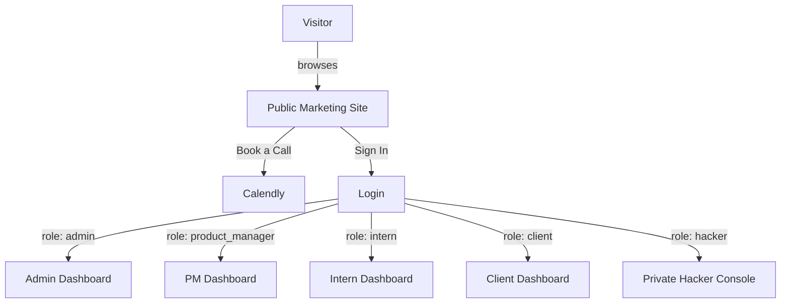
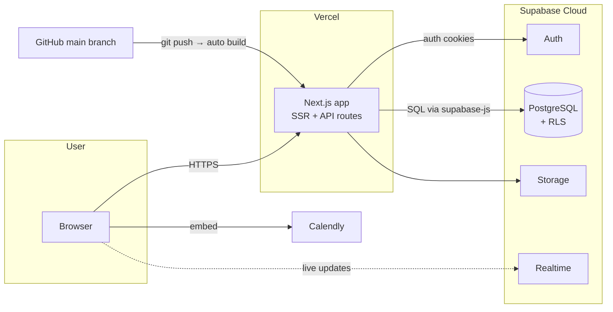
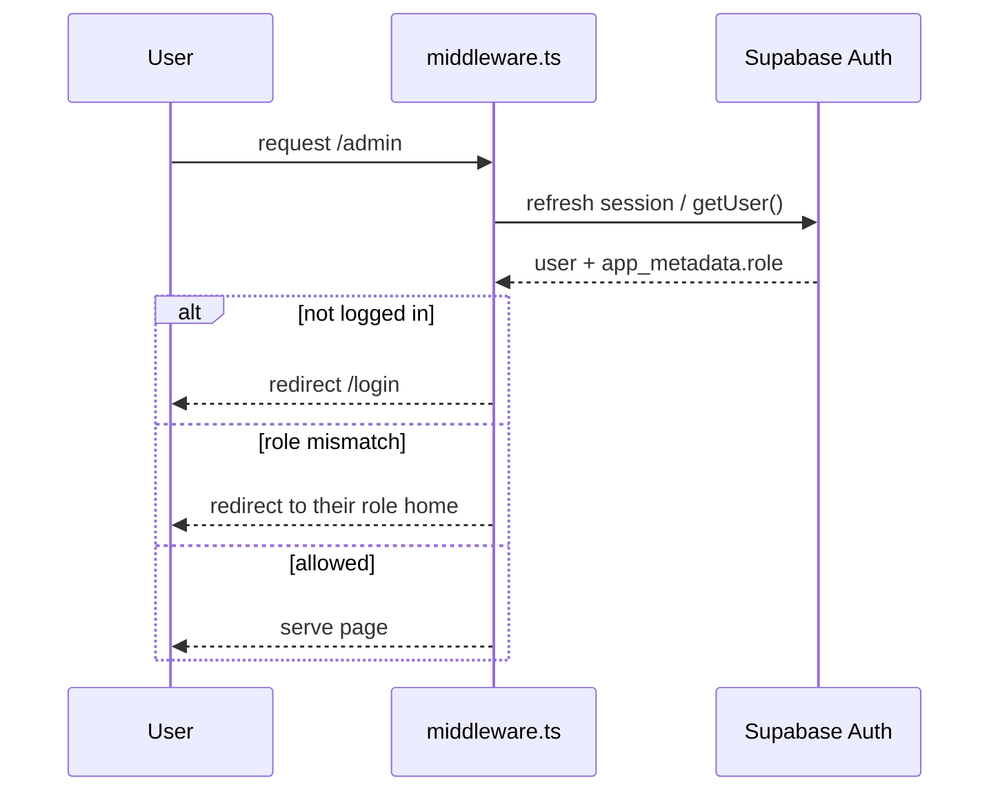
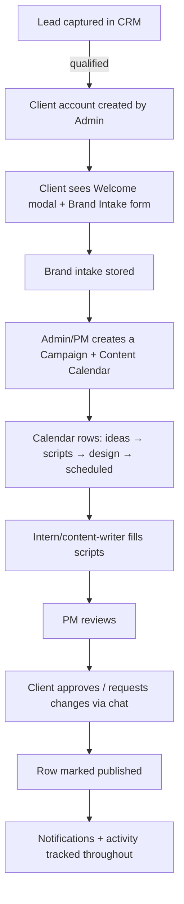
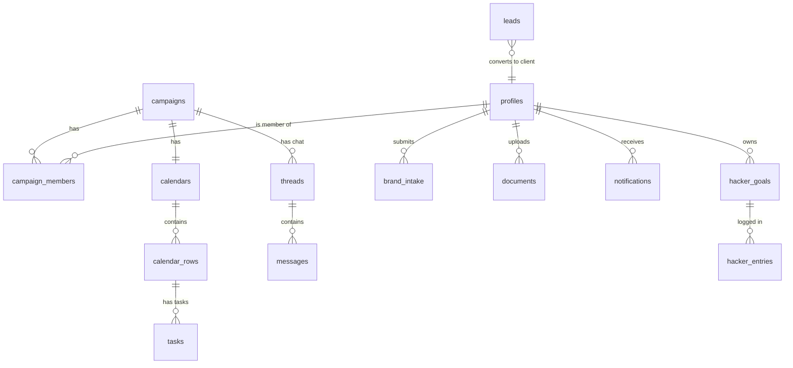
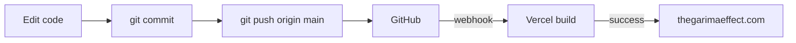

# The Garima Effect — Project Handover & Technical Documentation

> **Audience:** Garima Rana (owner) and any future developer who takes over this codebase.
> **Purpose:** Understand what the product is, how it is built, how it runs in production, how to maintain it, and where every account/credential lives.
> **Last updated:** June 2026.

---

## 1. What this project is

**The Garima Effect** is two things in one codebase:

1. **A public marketing website** — the brand's storefront at **https://thegarimaeffect.com**. Landing page (animated hero, about, services, founder reels, testimonials, contact), plus SEO content pages (services, case studies, blog, FAQ) and a **Book-a-Call** flow powered by Calendly.

2. **A private client-management platform** — a login-gated app where Garima's studio runs client work: a **content calendar lifecycle**, **leads CRM**, **brand intake**, **document uploads**, **chat**, and **notifications**, with four different user roles (admin, product manager, intern, client). There is also a separate private **"Hacker Console"** — a personal productivity/time-tracking tool.



---

## 2. Technology stack

| Layer | Technology | Notes |
|---|---|---|
| Framework | **Next.js 14** (App Router, React 18, TypeScript) | `frontend/` |
| Styling | **Tailwind CSS** + custom CSS variables (design tokens) | `frontend/app/globals.css` |
| Animation | **Framer Motion**, **GSAP**, **Three.js**, **Lenis** (smooth scroll) | hero + section animations |
| Backend / DB | **Supabase** (PostgreSQL, Auth, Row-Level Security, Storage, Realtime) | `backend/` |
| Scheduling | **Calendly** (embedded) | Book-a-Call |
| Hosting | **Vercel** (frontend) + **Supabase Cloud** (backend) | both free tier |
| Source control | **GitHub** — `thegarimaeffect/TheGarimaEffectWebsite` | auto-deploys to Vercel |
| Domain / DNS | **GoDaddy** (registrar) → points to Vercel | `thegarimaeffect.com` |

---

## 3. System architecture



**Request/auth flow:** every request passes through `frontend/middleware.ts`. It refreshes the Supabase session, reads the user's **role** from the JWT (`app_metadata.role`), and either allows the route, redirects to the correct dashboard, or sends unauthenticated users to `/login`. Public marketing pages bypass auth.



---

## 4. User roles & routing

Roles live in each user's Supabase `app_metadata.role`. The middleware maps role → home route and gates everything else.

| Role | Home route | Can access | Purpose |
|---|---|---|---|
| `admin` | `/admin` | everything | Garima — full control: people, brands, leads, calendars |
| `product_manager` | `/pm` | `/pm`, campaigns | Manages campaigns & content calendars |
| `intern` | `/intern` | `/intern` | Content writer / limited calendar editing |
| `client` | `/client` | `/client`, calendar, chat | The brand being served — approvals, intake, chat |
| `hacker` | `/hacker` | `/hacker` only | **Private** personal productivity tool (currently Suharsh's; see §10) |

Public routes (no login): `/`, `/about`, `/services`, `/case-studies`, `/blog`, `/faq`, `/contact`, `/login`, `/signup`, plus `robots.txt`, `sitemap.xml`, `llms.txt`.

---

## 5. Client workflow (the core business logic)

This is the lifecycle the platform was built to run:



Key tables backing this: `leads`, `profiles`, `brand_intake`, `campaigns`, `campaign_members`, `calendars`, `calendar_rows`, `calendar_days`, `tasks`, `threads`, `messages`, `documents`, `notifications`, `strategy_templates`.

---

## 6. Data model (high level)



Every table is protected by **Row-Level Security (RLS)** — users can only read/write rows they own or are authorized for. Policies are defined in the migration files (`backend/supabase/migrations/*_rls*.sql` and inline in feature migrations).

---

## 7. Repository layout

```
The_Garima_Effect/
├── frontend/                  # Next.js app (the website + platform)
│   ├── app/                   # routes (App Router)
│   │   ├── (marketing)        # /, /about, /services, /blog, /faq, /contact, /case-studies
│   │   ├── admin/ pm/ intern/ client/   # role dashboards
│   │   ├── hacker/            # private productivity console
│   │   ├── api/               # server API routes (admin, calendar, client, documents)
│   │   ├── login/ signup/     # auth pages
│   │   ├── layout.tsx         # root metadata + JSON-LD SEO
│   │   ├── robots.ts sitemap.ts  # SEO
│   ├── components/            # UI (Hero, About, Services, Calendly, dashboards, etc.)
│   ├── lib/supabase/          # Supabase client setup (browser/server/middleware)
│   ├── lib/seo-content.ts     # all SEO page copy (services, blog, FAQ, case studies)
│   ├── middleware.ts          # auth + role routing
│   ├── public/                # images, hero video, llms.txt
│   └── tests/                 # vitest test suites
├── backend/
│   └── supabase/
│       ├── migrations/        # 18 SQL migrations (schema, RLS, features)
│       └── seed.sql           # 4 test users + sample data
├── docs/                      # ← this documentation
└── docker-compose.yml         # local production stack (optional)
```

---

## 8. Running the project locally

**Prerequisites:** Node.js 20 LTS, Docker Desktop (for local Supabase), Git.

```bash
# 1. clone
git clone https://github.com/thegarimaeffect/TheGarimaEffectWebsite.git
cd TheGarimaEffectWebsite

# 2. install
npm install --prefix frontend
npm install --prefix backend

# 3. create frontend/.env.local  (see CREDENTIALS.md for values)

# 4. start the database (first run downloads ~1GB, ~5 min)
cd backend && npm run start

# 5. start the website (separate terminal)
cd frontend && npm run dev
# → http://localhost:3000
```

Run tests: `cd frontend && npm test`

---

## 9. Deployment

**The site auto-deploys.** Every push to the `main` branch on GitHub triggers a Vercel production build (~2 min). No manual steps.



- **Frontend env vars** are configured in the Vercel project settings (Production). They mirror `frontend/.env.local` but use the **cloud** Supabase keys.
- **Database changes** are NOT auto-deployed. To change the schema: add a migration in `backend/supabase/migrations/` and run `npx supabase db push` against the cloud project (requires the Supabase access token + DB password — see CREDENTIALS.md).
- **DNS:** GoDaddy has an `A` record (`@` → `76.76.21.21`) and a `CNAME` (`www` → `cname.vercel-dns.com`) pointing the domain at Vercel. SSL is auto-issued by Vercel.

---

## 10. Important notes for the new owner

1. **The "Hacker Console" (`/hacker`)** is a personal time-tracking tool created for Suharsh's own use. Its login (`suharsh@gmail.com`) should be **deleted** from Supabase Auth after handover, or repurposed for Garima. It is fully isolated from the client platform and removing it will not affect the website.

2. **Test/seed users** (`admin@garimaeffect.local`, etc.) use weak demo passwords. Before real use, either delete them or reset their passwords from the Supabase dashboard (**Authentication → Users**).

3. **Rotate all credentials** listed in `CREDENTIALS.md` after handover — GitHub token, Supabase keys, Vercel token were shared during development and should be regenerated by the new owner.

4. **Calendly availability** is managed entirely inside the Calendly account (calendly.com → Availability). No code change is needed to change when calls can be booked. Connect Google Calendar there so busy times auto-block.

5. **Content edits** (services, blog posts, FAQ, case studies) live in one file: `frontend/lib/seo-content.ts`. Edit, commit, push → it deploys.

6. **Costs:** everything currently runs on free tiers (Vercel Hobby, Supabase Free). The only paid item is the domain (~₹800–1500/year at GoDaddy). Watch Supabase's free-tier limits (500 MB DB, 50K monthly active users) as the studio grows.

---

## 11. Screenshots

> Capture these from the live site and the dashboards and drop them in `docs/screenshots/`, then link them here. (Listed so the next reader knows exactly what each screen should look like.)

| File | What to capture |
|---|---|
| `01-hero.png` | Homepage hero (envelope/video animation) |
| `02-about.png` | "Meet the Founder" section |
| `03-founder-speaks.png` | The Founder Speaks reel rail |
| `04-services.png` | Services cards |
| `05-book-a-call.png` | Calendly drawer open with the calendar |
| `06-login.png` | Login page |
| `07-admin.png` | Admin dashboard |
| `08-client-calendar.png` | Client content calendar |
| `09-hacker.png` | Hacker console spreadsheet |

---

## 12. Where to get help

- **Next.js:** https://nextjs.org/docs
- **Supabase:** https://supabase.com/docs
- **Vercel:** https://vercel.com/docs
- **Calendly embeds:** https://help.calendly.com

All three services have dashboards the owner can log into directly (see `CREDENTIALS.md`).
